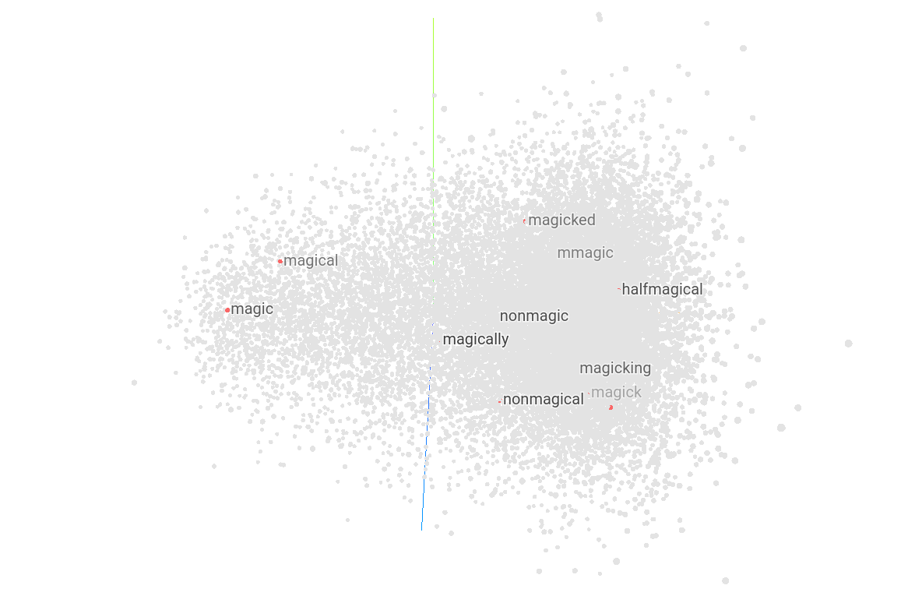

# Language model: Harry Potter

A language model was trained on [all harry potter books](https://www.kaggle.com/datasets/moxxis/harry-potter-lstm).


## Evaluation

### Generated text

```
harry potter | nigellus slughorn lovegood nameless curls slughorn mists threat slughorn phineas acknowledges
```

```
dementors | slughorn slughorn knew loathes slughorn slughorn hug lodges slughorn slughorn backup
```

```
dumbledore | flatout maxime marietta simultaneously demelza slughorn slughorn slughorn slughorn slughorn satingreen
```

### Loss


### Latent space




